# 🎯 Ultra-Granular CI/CD Architecture

## Overview

This repository implements an **ultra-granular, modular CI/CD architecture** designed for maximum visibility, debugging capability, and operational efficiency. Each workflow has a single, focused responsibility that can be executed independently or as part of the orchestrated pipeline.

## 🏗️ Architecture Principles

### Single Responsibility
- Each workflow focuses on **one specific concern**
- Clear input/output contracts
- Independent execution capability
- Isolated failure domains

### Ultra-Granular Visibility
- **Emoji-based job names** for instant visual recognition
- **Rich step summaries** with progress indicators
- **Detailed artifact naming** with context
- **Comprehensive pipeline reporting**

### Operational Excellence
- **Sophisticated conditional logic** for different contexts
- **Advanced artifact management** with appropriate retention
- **Error isolation** - failures don't cascade unnecessarily
- **Debugging-friendly** - each concern can be tested independently

## 🧩 Focused Workflows

### 1. 🔍 Change Detection (`change-detection-focused.yml`)
**Purpose**: Smart analysis of repository changes with configurable patterns

**Key Features**:
- **Configurable Pattern Matching**: Define patterns for source, test, config, and workflow changes
- **Publishing Recommendations**: Intelligent decision-making about whether changes warrant publishing
- **Change Summary Generation**: Detailed reports of what changed and why it matters
- **Context-Aware Logic**: Different behavior for PRs vs pushes vs releases

**Outputs**: `has-source-changes`, `has-test-changes`, `should-publish`, `change-summary`

### 2. 📋 Version Strategy (`version-strategy-focused.yml`)
**Purpose**: Context-aware versioning strategy determination

**Key Features**:
- **Multi-Strategy Support**: Preview, release, debug-release strategies
- **Branch-Aware Logic**: Different strategies for main, develop, release, hotfix branches
- **Change-Driven Decisions**: Strategy adapts based on detected changes
- **Configuration Flexibility**: Easy to extend with new strategies

**Outputs**: `package-strategy`, `build-configuration`, `should-increment`

### 3. 🔨 Build (`build-focused.yml`)
**Purpose**: Pure build operations with configuration support

**Key Features**:
- **Configuration-Driven**: Debug/Release builds with optimization controls
- **Artifact Management**: Optional artifact upload with descriptive naming
- **Build Validation**: Comprehensive build verification
- **Performance Optimized**: Efficient caching and restoration

**Outputs**: `build-artifacts`, `build-configuration`, `build-success`

### 4. 🧪 Test (`test-focused.yml`)
**Purpose**: Comprehensive testing with coverage reporting

**Key Features**:
- **Multi-Tier Testing**: Unit, integration, and performance tests
- **Code Coverage**: Configurable coverage collection and thresholds
- **Test Reporting**: Rich test result artifacts and summaries
- **Flexible Execution**: Fine-grained control over which tests run

**Outputs**: `test-results`, `coverage-percentage`, `coverage-passed`

### 5. 📦 Package Creation (`package-creation-focused.yml`)
**Purpose**: NuGet package creation with validation

**Key Features**:
- **Multi-Strategy Packaging**: Supports preview, release, and debug strategies
- **Package Validation**: Comprehensive package integrity checks
- **Symbol Packages**: Optional symbol package generation
- **Artifact Management**: Descriptive package naming with retention policies

**Outputs**: `package-path`, `package-version`, `validation-results`

### 6. 🚀 Package Publishing (`package-publishing-focused.yml`)
**Purpose**: Package publishing with comprehensive management

**Key Features**:
- **Multi-Feed Support**: NuGet.org, GitHub Packages, private feeds
- **Dry-Run Capability**: Test publishing logic without actual deployment
- **Cleanup Management**: Automated cleanup of old package versions
- **Publishing Verification**: Post-publish validation and reporting

**Outputs**: `published-version`, `published-feed`, `cleanup-results`

### 7. 🎯 CI/CD Orchestration (`ci-cd-orchestrated.yml`)
**Purpose**: Main pipeline orchestration with sophisticated conditional logic

**Key Features**:
- **Phase-Based Execution**: Clear phases with dependencies
- **Conditional Orchestration**: Smart skipping based on change detection
- **Rich Pipeline Reporting**: Comprehensive summary with next steps
- **Error Handling**: Graceful degradation and clear failure reporting

## 🔄 Execution Flow

```mermaid
graph TD
    A[🔍 Change Detection] --> B[📋 Version Strategy]
    B --> C{Source Changes?}
    C -->|Yes| D[🔨 Build]
    C -->|No| E[⏭️ Skip Build]
    D --> F[🧪 Test]
    E --> F
    F --> G{Should Publish?}
    G -->|Yes| H[📦 Package]
    G -->|No| I[⏭️ Skip Package]
    H --> J[🚀 Publish]
    I --> K[📊 Summary]
    J --> K
```



## 🎮 Operational Scenarios

### Pull Request Flow
1. **🔍 Change Detection** - Analyzes PR changes
2. **📋 Version Strategy** - Determines preview strategy
3. **🔨 Build** - Compiles changes (if source modified)
4. **🧪 Test** - Full test suite with coverage
5. **📊 Summary** - Rich PR feedback

### Main Branch Push
1. **🔍 Change Detection** - Analyzes push changes
2. **📋 Version Strategy** - Determines release strategy
3. **🔨 Build** - Release build (if needed)
4. **🧪 Test** - Full test suite
5. **📦 Package** - Creates release packages
6. **🚀 Publish** - Publishes to GitHub Packages
7. **📊 Summary** - Deployment confirmation

### Release Tag
1. **🔍 Change Detection** - Validates release changes
2. **📋 Version Strategy** - Production release strategy
3. **🔨 Build** - Optimized release build
4. **🧪 Test** - Full test suite with strict coverage
5. **📦 Package** - Production packages with symbols
6. **🚀 Publish** - Publishes to NuGet.org
7. **📊 Summary** - Release confirmation

## 🛠️ Debugging & Maintenance

### Independent Testing
Each focused workflow can be triggered independently:
```bash
# Test just the build process
gh workflow run build-focused.yml

# Test change detection with custom patterns
gh workflow run change-detection-focused.yml

# Test packaging with specific strategy
gh workflow run package-creation-focused.yml
```

### Artifact Investigation
- **Descriptive Naming**: `packages-{strategy}-{run-number}`
- **Appropriate Retention**: 7-30 days based on importance
- **Rich Metadata**: Artifacts include context and validation reports

### Error Isolation
- **Single Point of Failure**: Each workflow fails independently
- **Clear Error Messages**: Rich error reporting with actionable steps
- **Graceful Degradation**: Non-critical failures don't block the pipeline

## 📈 Benefits Achieved

### Developer Experience
- **🎯 Clear Visibility**: Instant understanding of pipeline status
- **🔧 Easy Debugging**: Isolated failures with clear context
- **⚡ Fast Iteration**: Test individual components without full pipeline
- **📊 Rich Feedback**: Comprehensive summaries and next steps

### Operational Excellence
- **🏗️ Modular Architecture**: Easy to extend and modify
- **🔄 Reusable Components**: Workflows can be reused across projects
- **📱 Mobile-Friendly**: Emoji-based status works great on mobile
- **🎛️ Fine-Grained Control**: Precise control over execution

### Maintenance Efficiency
- **🧩 Single Responsibility**: Easy to understand and modify
- **📝 Self-Documenting**: Clear naming and rich summaries
- **🔍 Focused Testing**: Test specific concerns in isolation
- **⚙️ Easy Extension**: Add new workflows without disrupting existing ones

## 🚀 Getting Started

### For Developers
1. **Understanding Status**: Look for emoji indicators in Actions tab
2. **Debugging Failures**: Click into specific focused workflows
3. **Manual Triggers**: Use workflow_dispatch for testing
4. **Artifact Review**: Download artifacts for detailed analysis

### For DevOps
1. **Workflow Customization**: Modify individual focused workflows
2. **New Integrations**: Add new workflows following the same patterns
3. **Monitoring**: Set up alerts based on specific workflow failures
4. **Optimization**: Profile individual workflows for performance

## 📋 Configuration

Each workflow supports extensive configuration through inputs:

```yaml
# Example: Custom test execution
uses: ./.github/workflows/test-focused.yml
with:
  run-unit-tests: true
  run-integration-tests: false
  collect-coverage: true
  coverage-threshold: 85
  fail-on-coverage: true
```

## 🔮 Future Enhancements

- **🔔 Slack Notifications**: Rich notifications with emoji status
- **📱 Teams Integration**: Pipeline summaries in Teams channels  
- **🎨 Custom Badges**: Dynamic badges reflecting pipeline health
- **📊 Analytics Dashboard**: Pipeline performance and trends
- **🤖 AI-Powered Insights**: Intelligent failure analysis and suggestions

---

*This architecture represents a modern, developer-friendly approach to CI/CD that prioritizes visibility, debuggability, and operational excellence.*